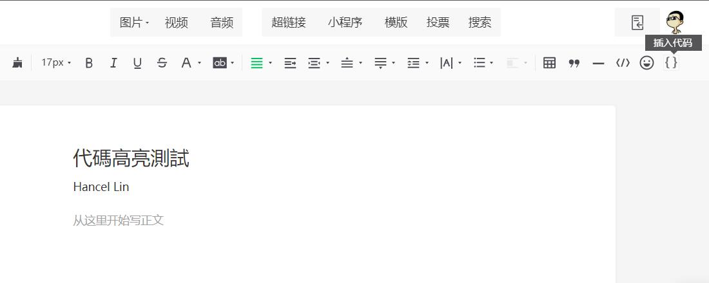
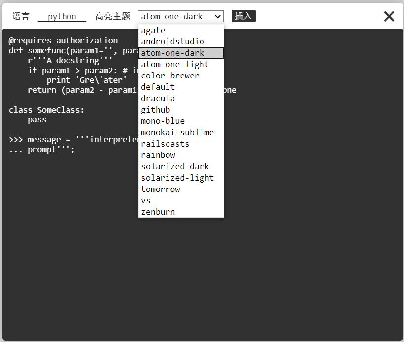
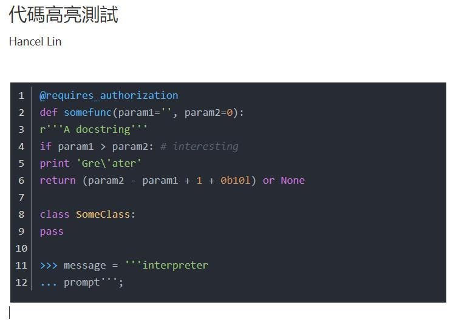
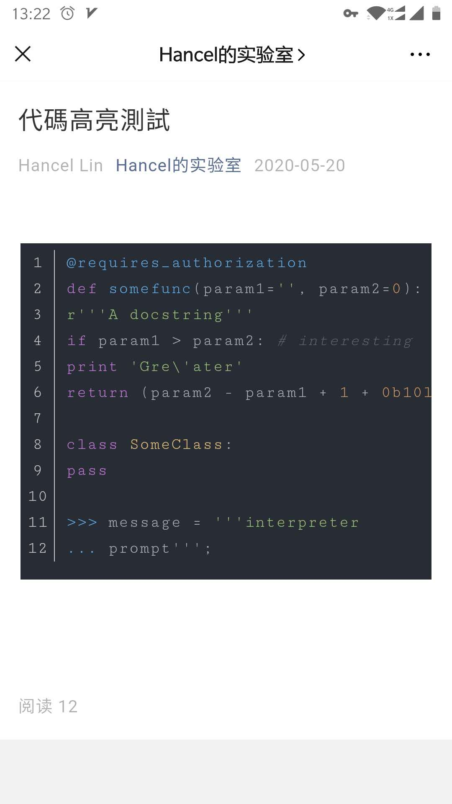
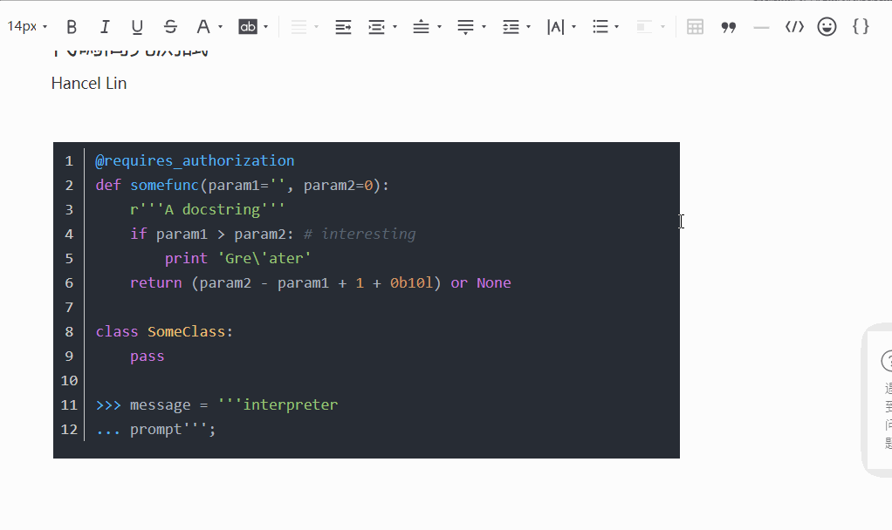
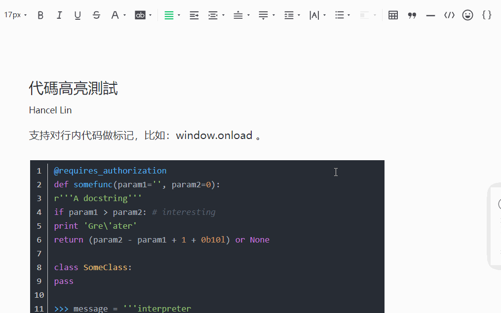

# 微信公众平台代码高亮插入插件

安装此插件可用于在微信公众平台文章编辑时插入带高亮格式代码。

## 更新记录

### 2.0.0 - [2020/05/20]
1. 加入代码行号；
2. 自适应单行长度，无需再自行填写；
3. 自动记住最后一次插入的语言；
4. 加入对标记的行内代码取消标记的功能；
5. 更新编辑器图标为 SVG Data URL（不再是引用外部资源）。

### 1.3.0 - [2020/02/05]
1. 加入可对已插入的代码修改功能（点击代码块再点击插入代码按钮）。
2. 加入可选择高亮主题功能。

### 1.1.1 - [2018/05/15]
1. 修正行内代码高亮时，没有对 HTML 标签转义。
2. 更新行内代码样式。

### 1.1.0 - [2018/05/15]
1. 新增片段代码样式，可以选择段落中某个片段代码。点击添加底色和等宽字体。
2. 修正公众号改版后，提示文本样式错误问题。

## 效果图

1. 安装后会在编辑器上新增一个按钮；  
     
2. 点击按钮会出现一个代码编辑器，写好代码，填写对应的**编程语言**后按`插入`，也可以选择不同的代码**高亮主题**；  
     
3. 最终效果；  
     
4. 手机上的效果；  
     
5. 支持对已插入的代码做二次编辑；
   
6. 支持对行内代码做标记。  
   

## 手动安装方式

1. 下载[wx_code_highlight.crx](wx_code_highlight.crx)；  
2. 打开`chrome://extensions/`，将开发者模式打开。  
3. 将 **wx_code_highlight.crx** 拖拽进去即可。

## 应用商店安装
https://chrome.google.com/webstore/detail/kbiedhbfjcadjlajanccenpiicgdbfaf